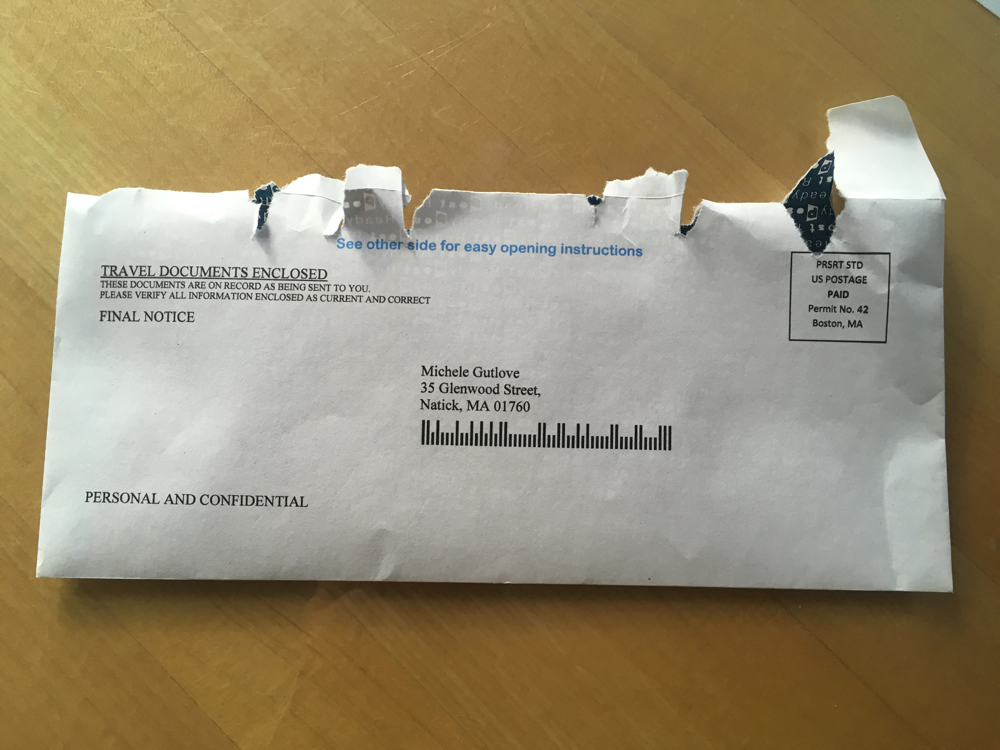
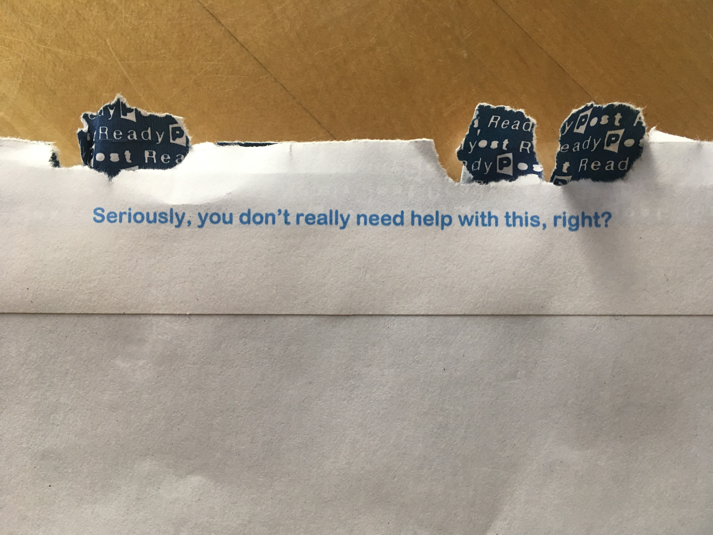
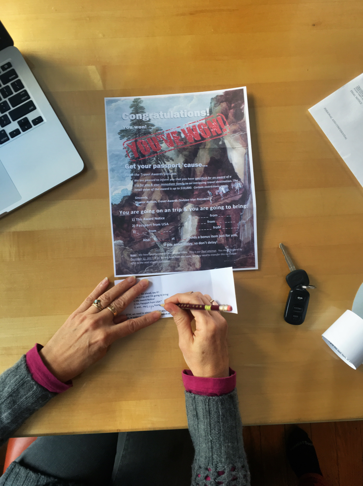
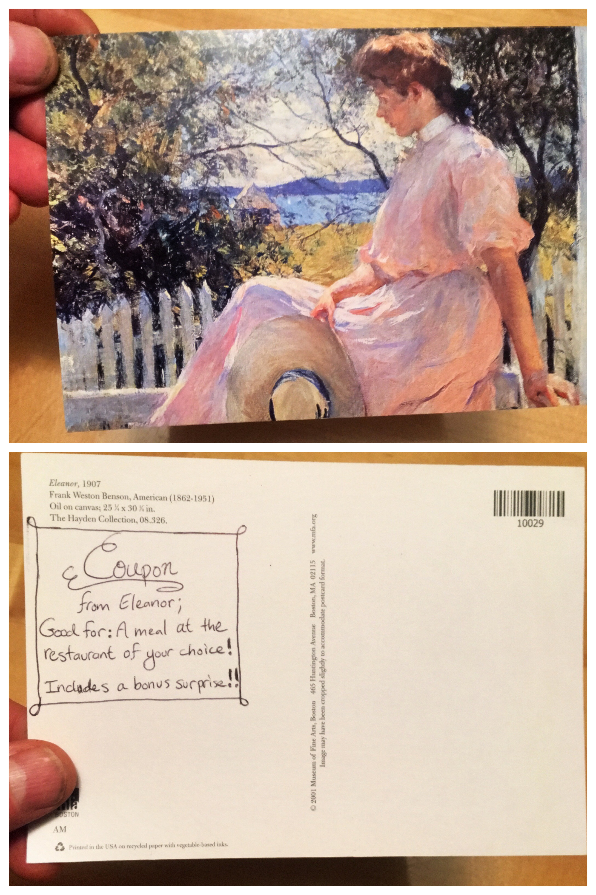
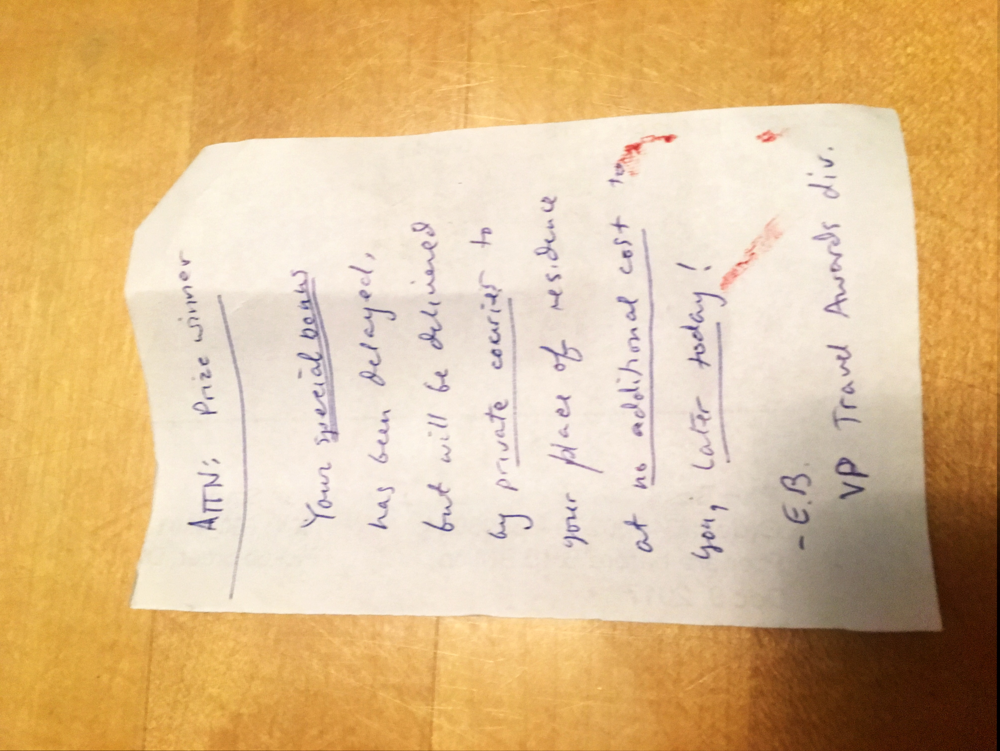
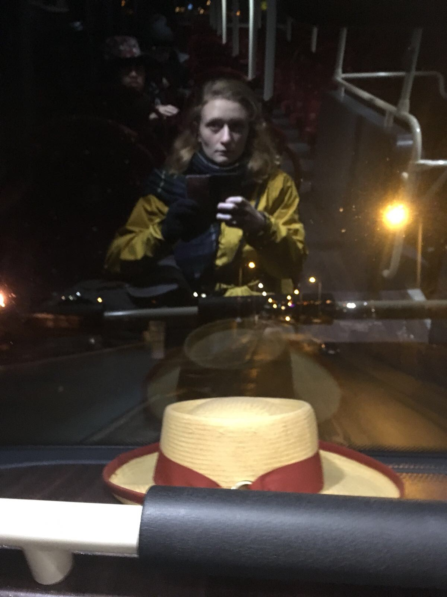

It started with what seemed to be junk mail:

but was actually a real prize:

it led to the Isabella Stuart Gardener Museum, where the arrivee was supposed to be waiting

but, the flight was delayed, so we had to improvise...

In the end, she made it, and came bearing _un bel cappello_

