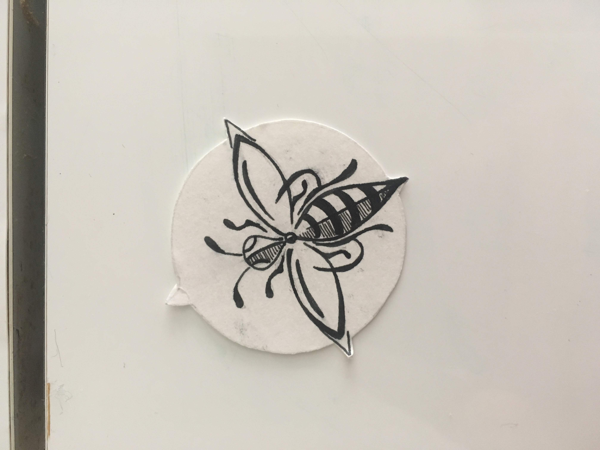
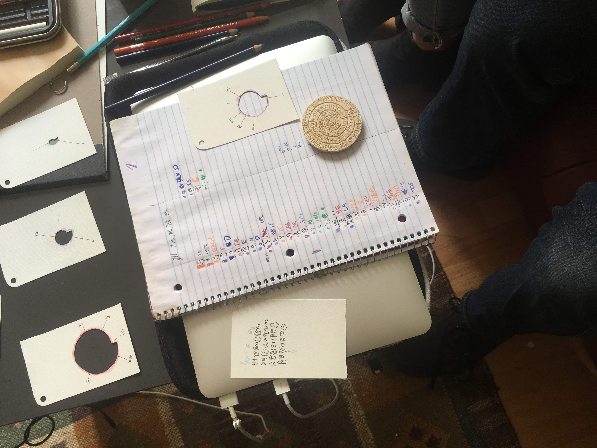
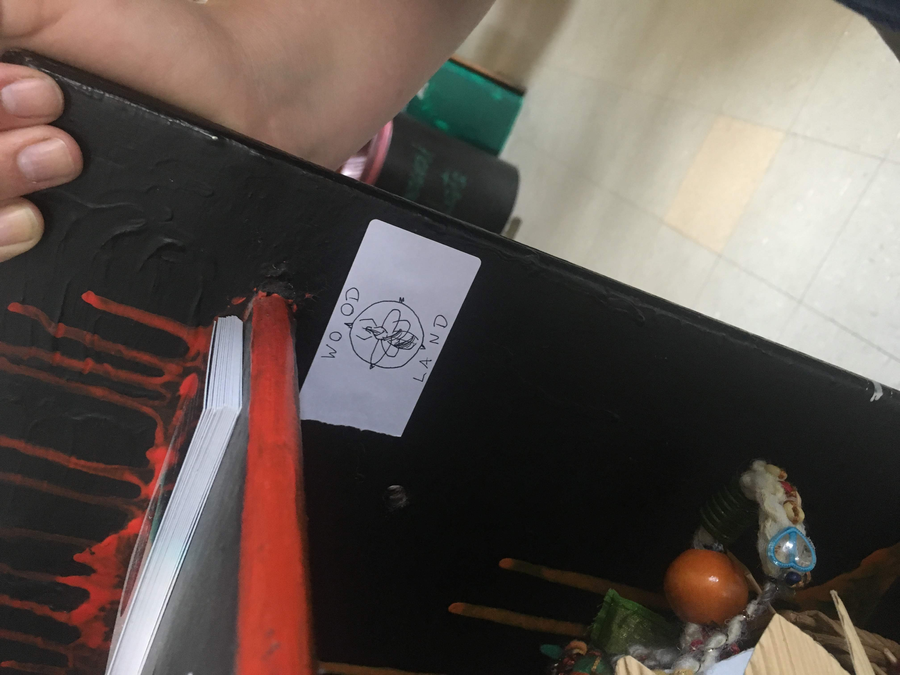
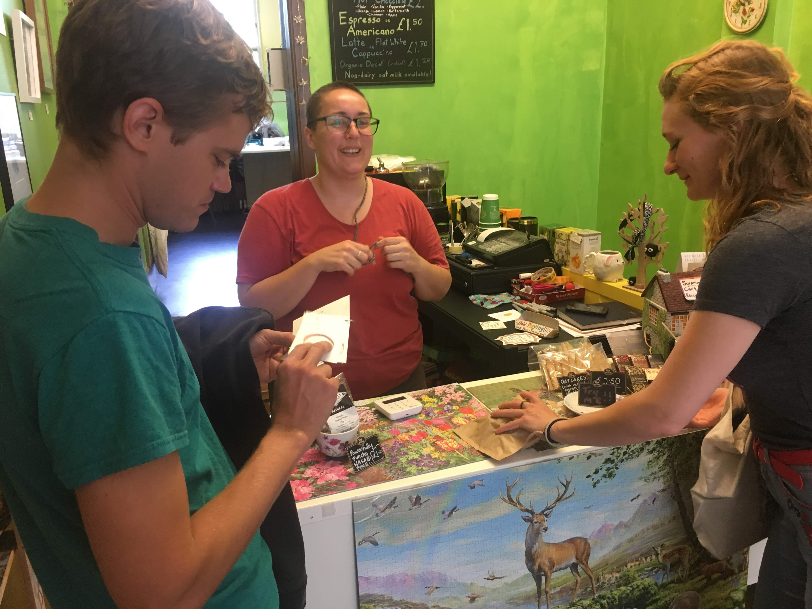
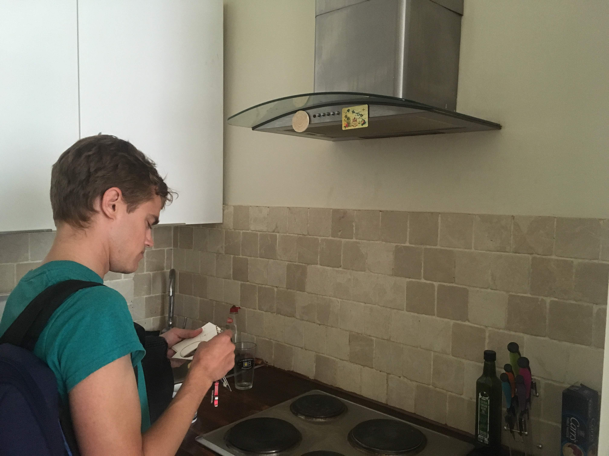
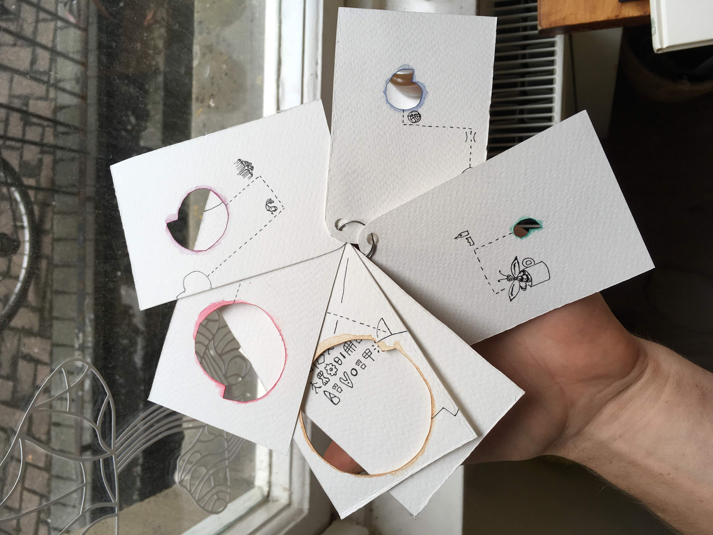
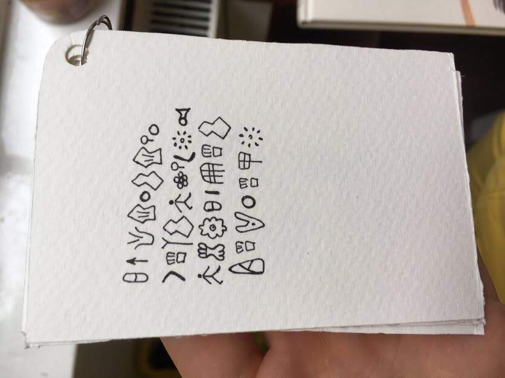
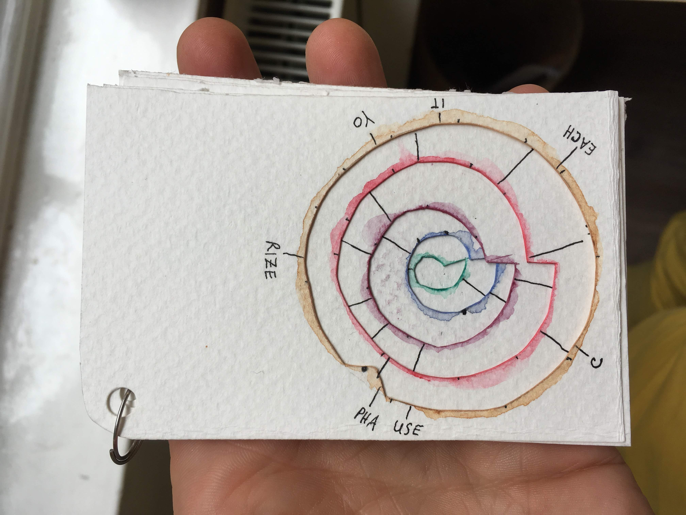
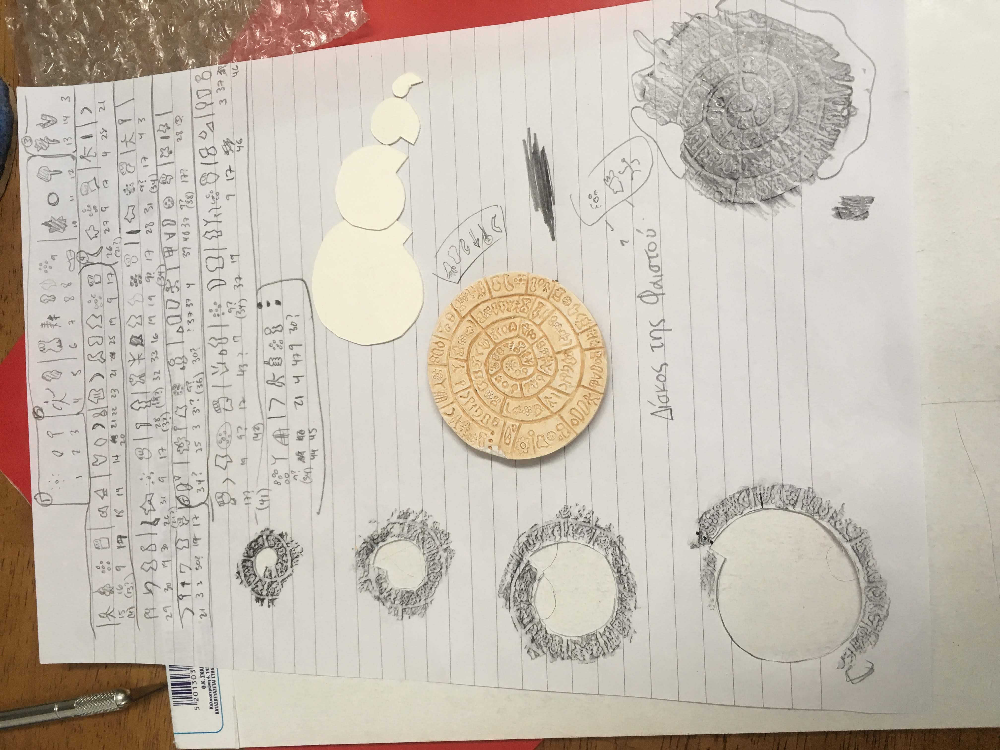
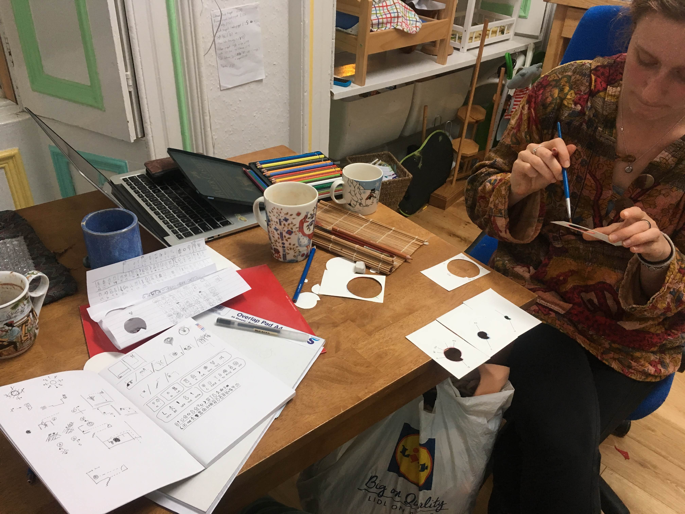

What was the story here?  Did this twender surprisingly start at the end of an earlier twender? I can't remember... the prize was a [magnet of the phaistos disc](phaistos.jpg), which was also an integral part of the puzzle.

A bee sigil was involved.

Here is John solving it.

A booklet 

---------

Preparation photos:

