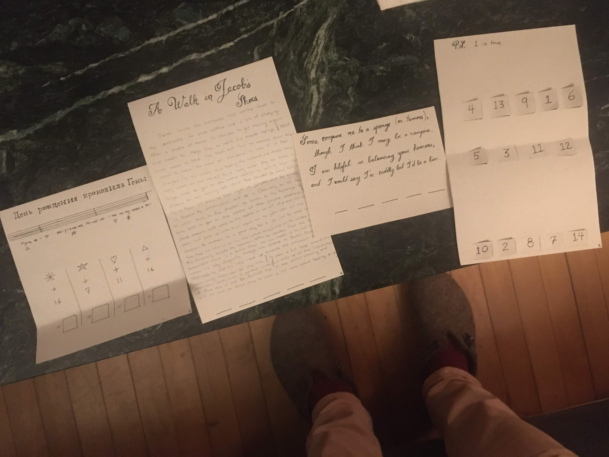

# 1 a cryptic note

It started with a ciphered note at dinner, devised by Ian:

--->

this led us to the studio theater...

# 2 Washer and dryer

The next component was an ingenious build-it-yourself washer and dryer kit, by Aliza and John,

Which we marvelled at, [as we compiled it](laundry-solving.jpg).  There was a message inside,

,

reading `DRYER`.  (and also, the message `1 is random`)

# 3 Greenest While

This clue was a lovely thing, printed on Zoe's mother's printing press in Viroqua, whence Zev had just returned

--->

leading to `steering wheel`  (and also, the message `1 is false`)
# 4 A Walk in Jacob's Shoes

A multi-part puzzle, crafted by Katie, 

leading one around Montreal in a pattern which spelt out part of the answer

the rest coming from some other clues

In the end this led to the answer:

`cellphone tower`, with the additional information `1 is true`

# 5 At the cellphone tower

At the cellphone tower, in the dark, we found [some things that we thought were clues, but werent](zev-false-clue.jpg), but the thing we were looking for was an envelope, unlabeled, pinned to a tree.

# 6 Oracles

A message leading to the final part (by Ian)

Heading to the studio, we found **the oracles** 

their three individual natures being, of course

- one tells the truth  (`1 is true`, from Katie's puzzle)
- one tells the opposite of the truth (`1 is false`, from Zev's puzzle)
- one is random (`1 is random`, from Aliza and John's puzzle)

They explained that we could only ask two questions.

It took us a few hours to find the solution, but we found it in the end, and Jacob opened the package of triumph, which contained an iPhone, a present from Zev.
