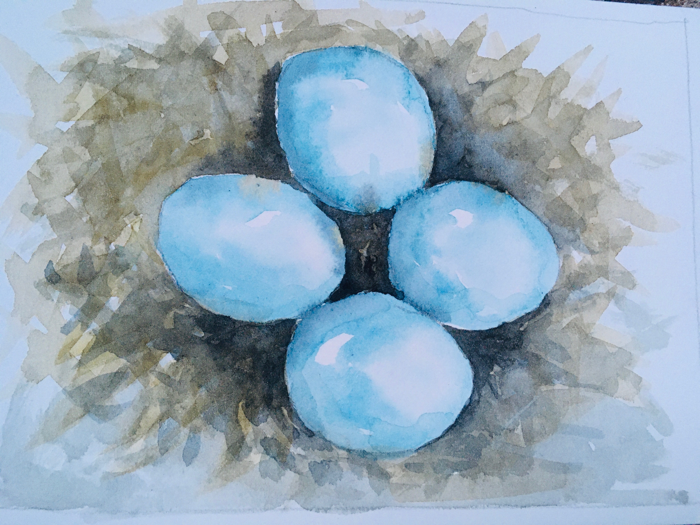

# 1 Starting materials 

- This sheet with a puzzle by Zevi and Zoe:

leading to a four digit number `7924`, which is useful later.

- This sheet with a puzzle by by Ian and Jasmine:

--->

instructing us
<code>
	<del>DO NOT</del> OPEN BEFORE JUNE 30
</code>

opening the envelope, we found tickets to the theater:

------------

# 2 the 'just before time' museum

This image, by Aliza and John, projected in the studio:

which (taking the letter just before the date, in chronological order) led to `charlie's charles`

------------

# 3 _Tacko & Jebia's Mother's Day Adventure Tour_ 

by Katie and Jacob

Starting in the cemetery, materials were this map:

and this guide:

all other _Tacko and Jebia_ pages are here:


  - [{{ item.title }}]({{item.url}})


leading here and there, through the woods, then home, where we collected the three paintings "Our Nest", "Together", "Flying Together":

then down all the way to S Natick center, where there were [helmets locked up](helmets.jpg) to a dogwood tree. The code from part 1 (`7924`) unlocked the helmets, and inside was the last puzzle.

-------------

# 4 
by Zevi and Zoe

This sheet hidden in the helmets:

gave `6008`, the lock code on [the](done-kiss.jpg) [tandem](done1.jpg).

[Done!](done2.jpg)