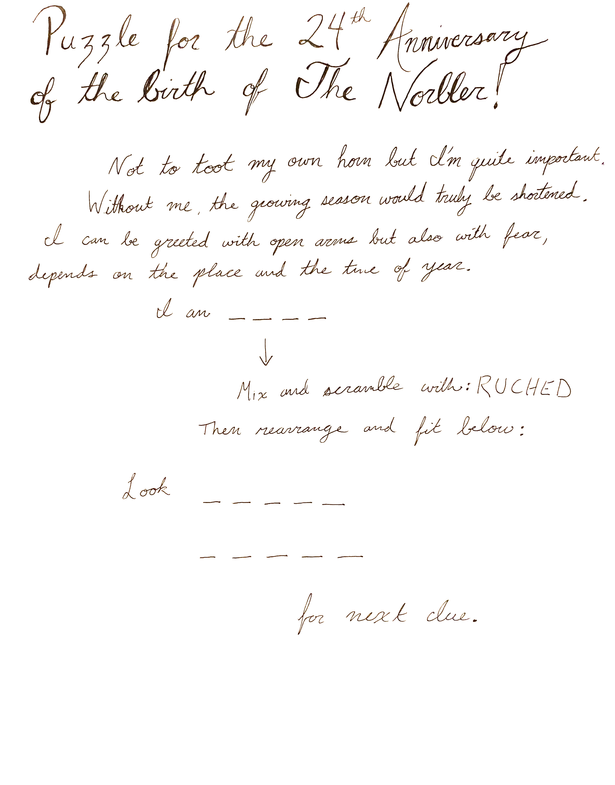
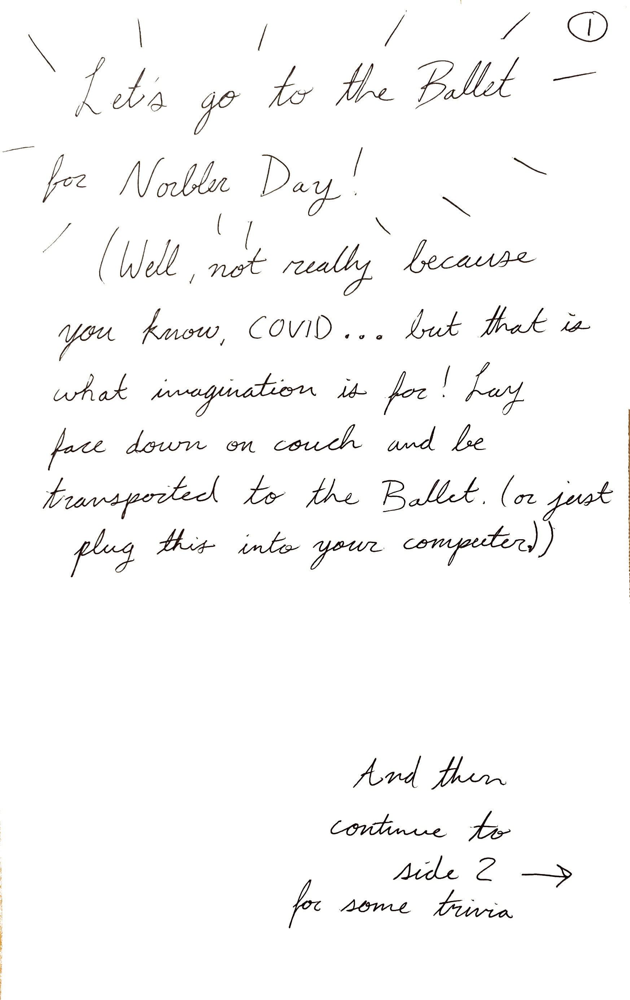
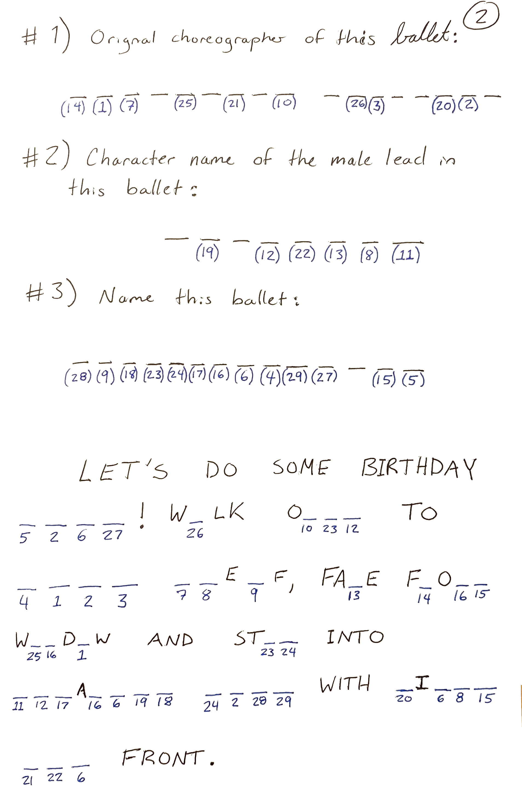
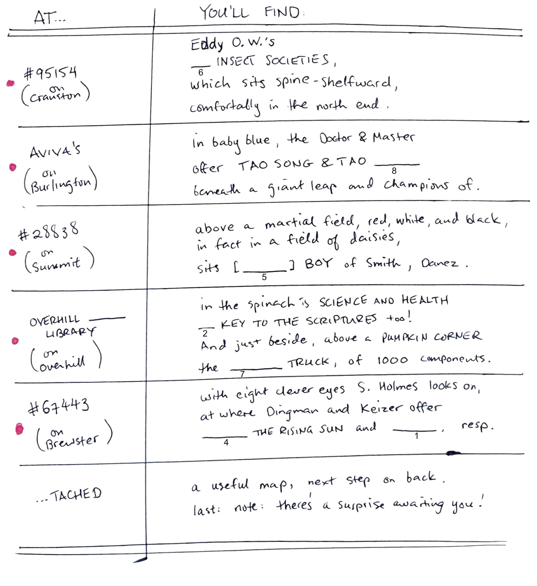
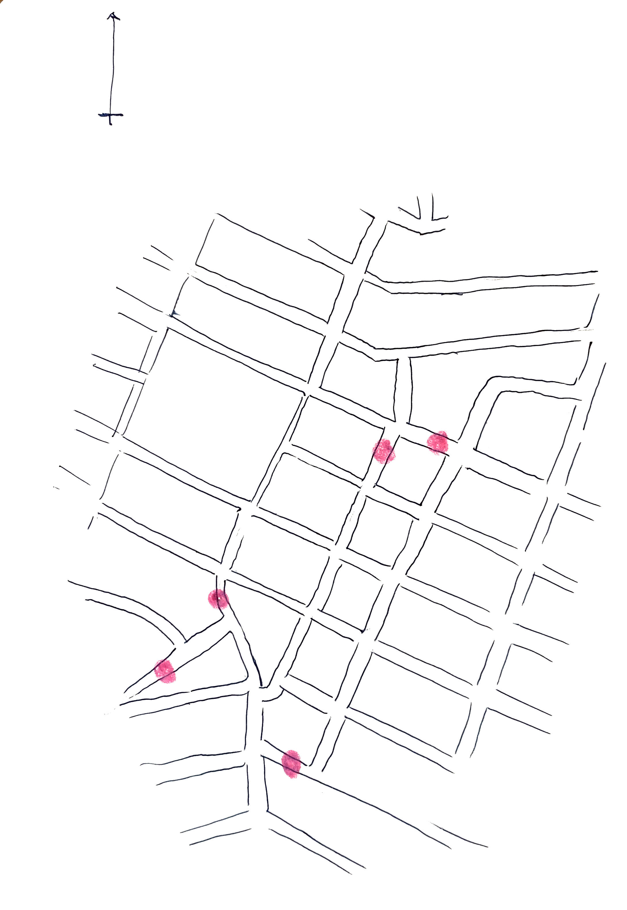
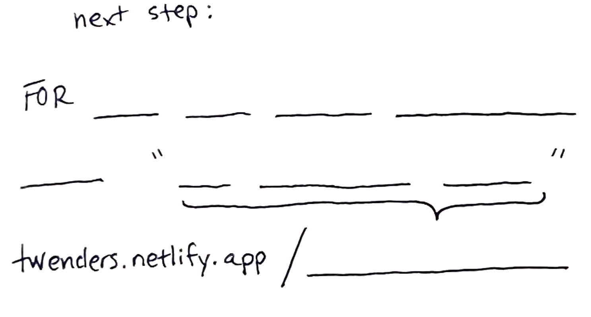

# Part I

It started with this introducing message:

which led to Nora looking under her chair (see [SOLUTION](part1-solns/soln_first.jpg)), and finding the second bit, a ballet music recognition quiz, involving the following slip of paper, and a thumb-drive with three tunes on it

- [tune 1](part1/ballet-music/Ballet1.m4a)
- [tune 2](part1/ballet-music/Ballet2.m4a)
- [tune 3](part1/ballet-music/Ballet3.m4a)

this led to doing some yoga, and finding the next puzzle (Part II, below), taped to the bottom of a shelf (see [ballet tunes SOLUTION](part1-solns/soln_ballet-tunes.jpg)).  

# Part II

a conundrum devised by jacob, involving two slips of paper: 

- 1: a table

[SOLUTION to the table here](part2-solns/soln_at-youll-find.jpg)

- 2: a map, with 'next step' on the back

After traipsing around the neighborhood, looking in all the "Little Free Libraries", this puzzle led to filling out the message on the back of the map, as:

> FOR **HELP WITH PUZZLE DECIPHERING**
> 
> **INSERT** "THE ICE CREAM DANCE"
> 

giving the solution, a link to this website, at the unindexed page: [twenders.netlify.app/theIceCreamDance](twenders.netlify.app/theIceCreamDance)    

which led to the prize, hidden in a rain hat, hung on a hook: a pair of socks which Katie had finished knitting just earlier in the evening.
