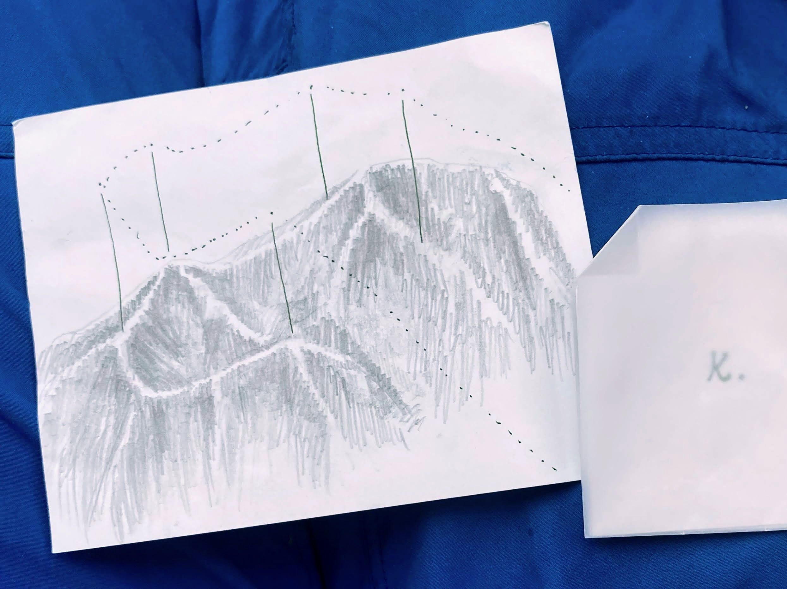
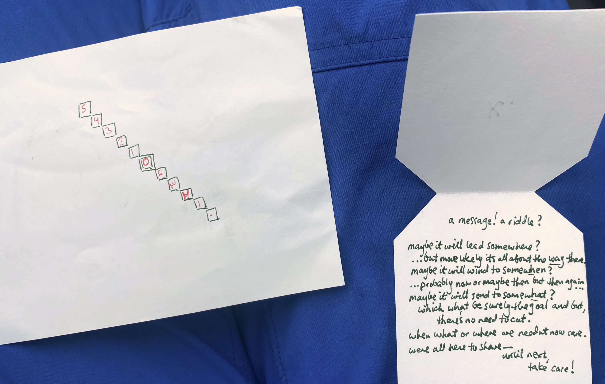
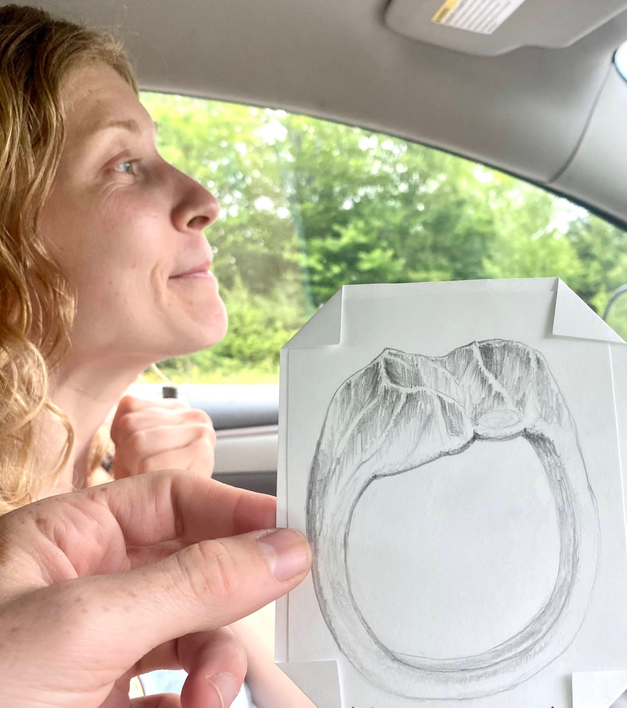

Starting note and sketch with a diagonal of empty boxes on back (solution later filled in in red):

Then, a series of little notes found at random points while hiking the Katahdin-Hamlin ridge loop (first note at left through fifth at right)

each had two symbols on the back:

This led to the final 

Soln

  <pre>
  ⃞5
   ⃞4
    ⃞3
     ⃞2
      ⃞1
       ⃞ 
        ⃞٤
         ⃞٣
          ⃞٢
           ⃞١
            ⃞٠
  </pre>

  

